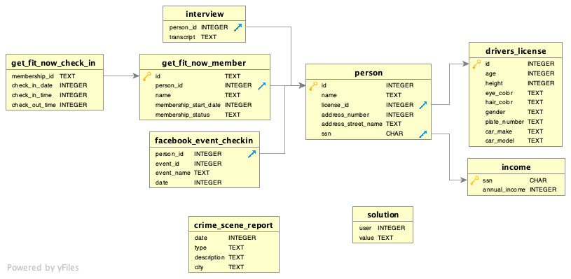

# SQLMurderMystery

In this project I'm solving the [SQL Murder Mystery](https://mystery.knightlab.com/)

## Description
A crime has taken place and the detective needs my help. The detective gave me the crime scene report, but I somehow lost it. I vaguely remember that the crime was a ​murder​ that occurred sometime on ​Jan.15, 2018​ and that it took place in ​SQL City​. I should start by retrieving the corresponding crime scene report from the police department’s database.

## Database schema:


## Retrieving the crime scene report
Since I remember that the crime was a `​murder`​ that occurred sometime on `​Jan.15, 2018`​ and that it took place in `​SQL City`, I'm going to search the **crime_scene_report** table to retrieve the discription of the crime with the following [query](queries/crime_scene_report_description.sql).

```sql
select description
from crime_scene_report   
where date=20180115 and city='SQL City' and type='murder'
```
Output:
```
Security footage shows that there were 2 witnesses. The first witness lives at the last house on "Northwestern Dr". The second witness, named Annabel, lives somewhere on "Franklin Ave".
```
## Witnesses
From the report above I know we have **2** witnesses:
1. located at the `last` house on `"Northwestern Dr"`
2. `Annabel`, somewhere on `"Franklin Ave"`. 

**Let's search!**

I notice that the clues I'm looking for are attributes in the person table and all I need for now are their IDs.

[Witness 1](queries/witness1_id.sql)
```sql
select id
from person
where address_street_name='Northwestern Dr'
order by address_number desc 
limit 1
```
Output: 
`ID=14887`

[Witness 2](queries/witness2_id.sql)

```sql
select id
from person
where name like 'Annabel%' and address_street_name = 'Franklin Ave'
limit 1
```
Output: 
`ID=16371`

## Witnesses Interviews

Let's [see](queries/witnesses_interviews.sql) what the witness 1 & 2 saw that night.

> I'm going to use the persons ID on the interview table (where the person_id is the FK from the person table)

```sql
select 
case
	when person_id=14887 then 'Witness 1'
	else  'Witness 2'
end as witness, transcript	
from interview
where person_id in (14887, 16371)
```
Output:

|witness|transcript  |
|--|--|
|Witness 1 |I heard a gunshot and then saw a man run out. He had a "Get Fit Now Gym" bag. The membership number on the bag started with "48Z". Only gold members have those bags. The man got into a car with a plate that included "H42W".  |
|Witness 2 | I saw the murder happen, and I recognized the killer from my gym when I was working out last week on January the 9th. |

## Following the leads

From the witnesses interviews we got the following leads:
- man
- "Get Fit Now Gym" bag
- membership number started with "48Z"
- gold membership status
- car plate includes "H42W"
- last week, 9th of Jan

**Let's search!**

First, I'm going to extract all the person IDs from the gym info that I got from the witnesses, hence I'll be using the tables get_fit_now_check_in and get_fit_now_member.

Then, I will limit down the suspects, based on their license plates.

Gym Info [Query](queries/suspects_from_gym_info.sql)

```sql
select get_fit_now_member.person_id
from get_fit_now_member
inner join get_fit_now_check_in
   on get_fit_now_member.id=get_fit_now_check_in.membership_id
where get_fit_now_check_in.check_in_date=20180109 and get_fit_now_member.id like '48Z%'
 and get_fit_now_member.membership_status= 'gold'
```
Output:

| person_id |
|--|
|  28819  |
|  67318  |

License Info [Query](queries/main_suspect_license.sql)

```sql
select person.id as MainSuspect
from person
inner join drivers_license
   on person.license_id=drivers_license.id
where drivers_license.plate_number like '%H42W%' and person.id in (28819,67318)
```
Output:
| MainSuspect |
|--|
|  67318  |
